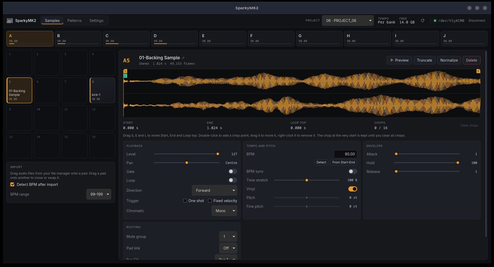

# SparkyMK2

An open-source editor and librarian for the **Roland SP-404MKII**, built for Linux.
The goal is feature parity with Roland's official SP-404MKII App (Windows/macOS): manage
samples, pads, patterns and projects on the device over USB.



> Not affiliated with or endorsed by Roland Corporation. "SP-404MKII" and "Roland" are
> trademarks of Roland Corporation.

> Vibe coded: an AI assistant wrote most of this, from the protocol notes in
> [docs/re/](docs/re/) and against real hardware. See
> [How it was made](#how-it-was-made).

## Status

**Early, but the core works.** The USB protocol is decoded and documented, and a Rust
core with a command-line tool (`sp404`) talks to real hardware.

- Verified against an SP-404MKII on firmware **5.52**, from Windows and Linux.
- A desktop app edits samples, pads and project settings, and shows patterns. A plugin
  version comes later.

Feature-by-feature progress against the official app is tracked in
[docs/parity.md](docs/parity.md).

## What it can do

**Device and projects**
- Show status: current project, tempo settings, bank tempos, volumes and protection, free
  space.
- List, select, rename, Init (all, samples, patterns, or a single bank) and restore
  projects.
- Back up a whole project to a folder; the result is byte-identical to the official app's
  export.
- Browse and download files from the SD card.

**Samples and pads**
- Import WAV, AIFF, FLAC or MP3 at any sample rate. Audio is converted to the device's
  48 kHz 16-bit format; mono stays mono.
- Export pad samples to WAV.
- Read and set every pad parameter: start/end, loop top, level, pitch, time stretch,
  envelopes, chop points and more.
- Truncate, normalize, delete, rename.
- Move, overwrite or exchange samples between pads.
- Preview pads, and read waveform peaks.
- Analyze BPM, Set BPM by Start/End, and automatic BPM detection on import, following the
  official app's rules.
- Key detection, which the official app doesn't have.

**Patterns**
- List patterns.
- Export a pattern as a Standard MIDI File, byte-identical to the official app's export.
- Bounce a pattern to WAV, or render each pad separately (MULTIPAD). The device renders
  these itself.

**Offline tools**
- Inspect project backups (`PADCONF.BIN`, pattern files, SMP samples) without the device.
- Convert audio to the SMP format.
- Analyse audio files for tempo and key.

## Install

Download the latest release from the
[Releases page](https://github.com/TuscanPL/SparkyMK2/releases). The packages pull in
what they need:

| System | Download | Install |
|---|---|---|
| Debian, Ubuntu, Mint | `sparkymk2_X.Y.Z_amd64.deb` | `sudo apt install ./sparkymk2_*_amd64.deb` |
| Fedora | `sparkymk2-X.Y.Z-1.x86_64.rpm` | `sudo dnf install ./sparkymk2-*.x86_64.rpm` |
| Arch, CachyOS, Manjaro | from the AUR | `yay -S sparkymk2` or `paru -S sparkymk2` |
| Other distributions | `sparkymk2_X.Y.Z_amd64.AppImage` | `chmod +x sparkymk2_*.AppImage`, then run it |
| Windows 10 or 11 | `sparkymk2_X.Y.Z_x64-setup.exe` | run it; Windows warns first, because the installer is not signed |

The .deb, .rpm and AUR packages let the logged-in user open the SP-404MKII straight away.
With the AppImage, set up serial port access once (see [Linux setup](#linux-setup)).

The Windows build is new. The protocol work and the command-line tool both come from
Windows, but the app itself has not been tried there yet; reports are welcome. Windows
needs no driver or extra setup: the sampler appears as a COM port, and the app finds it.

## Building

You need Rust 1.85 or newer (install via [rustup](https://rustup.rs)).

```bash
git clone https://github.com/TuscanPL/SparkyMK2.git
cd SparkyMK2
cargo build --release
```

The binary is `target/release/sp404`.

### Desktop app

The app in `app/` uses [Tauri](https://tauri.app) with a Vue frontend. Besides Rust it
needs Node.js 20.19 or newer and WebKitGTK 4.1:

```bash
# Arch / CachyOS / Manjaro
sudo pacman -S --needed webkit2gtk-4.1

# Debian / Ubuntu
sudo apt install libwebkit2gtk-4.1-dev

# Fedora
sudo dnf install webkit2gtk4.1-devel
```

If a build step still reports a missing library, see Tauri's
[Linux prerequisites](https://tauri.app/start/prerequisites/#linux).

```bash
cd app
npm install
npm run tauri dev      # run with live reload
npm run tauri build    # build a release binary and packages
```

`cargo build` in the repository root builds only the command-line tool.

On Arch-based distributions you can install the app as a package, with a launcher entry
and icon. The same command updates it after you change or pull the code:

```bash
packaging/arch/update.sh
```

It builds the package from your checkout and installs it with pacman, which asks for your
password. The version includes the commit, so each new commit installs as an upgrade.

### Linux setup

USB port discovery needs libudev and pkg-config:

```bash
# Arch / CachyOS / Manjaro
sudo pacman -S --needed systemd-libs pkgconf

# Debian / Ubuntu
sudo apt install libudev-dev pkg-config

# Fedora
sudo dnf install systemd-devel pkgconf-pkg-config
```

The SP-404MKII shows up as a USB serial device (`/dev/ttyACM*`, kernel driver
`cdc_acm`). The packages give the logged-in user access to it. With the AppImage or a
source build, either install the same udev rule and replug the sampler:

```bash
sudo install -Dm644 packaging/linux/70-sp404mkii.rules /etc/udev/rules.d/70-sp404mkii.rules
```

or join the serial port group, then log out and back in:

```bash
# Arch-based distributions
sudo usermod -aG uucp "$USER"

# Debian, Ubuntu, Fedora
sudo usermod -aG dialout "$USER"
```

## Usage

Connect the SP-404MKII by USB. Only one program can use the device at a time, so quit
or disconnect the official app first.

```bash
sp404 status                          # current project, tempo, free space
sp404 pads                            # pads that hold samples
sp404 pad B1                          # all parameters of pad B1
sp404 set B1 level 100                # change a parameter (`sp404 params` lists them)

sp404 import J16 loop.flac --detect-bpm   # import audio onto a pad, detect its tempo
sp404 sample-to-wav B1 bass.wav           # export a pad's sample
sp404 analyze-pad B1 --set-bpm            # detect tempo and key, store the BPM

sp404 export-project 6 ./backup       # back up project 6
sp404 export-pattern A1 beat.mid      # pattern → MIDI file
sp404 bounce-pattern A1 beat.wav      # pattern → WAV rendered by the device
```

Run `sp404 --help` for all commands, and `sp404 <command> --help` for details. Add `-v`
or `-vv` to log protocol traffic.

### Commands that erase data

- `init-project` and `restore-project` overwrite a project on the SD card. Both refuse to
  run without `--yes`.
- Both select the target project on the device first: the device always applies Init to
  the project that is currently selected.
- Back up with `export-project` before using them.

## Project layout

```
crates/sp404-proto     protocol without I/O: framing, file API, parameters, pads, patterns
crates/sp404-formats   SMP samples, PADCONF.BIN, patterns, MIDI export, audio import
crates/sp404-device    USB serial connection (0582:02E7, 921600 baud)
crates/sp404-dsp       tempo and key detection
crates/sp404-cli       the `sp404` command-line tool
app/                   desktop app: Vue frontend, Tauri backend in app/src-tauri
packaging/             Arch and AUR packages, launcher entry, udev rule
scripts/release.sh     prepares a release (see docs/releasing.md)
docs/re/               protocol and file-format specification
docs/parity.md         feature checklist against the official app
tools/                 Windows capture and analysis scripts used for reverse engineering
```

## How it was made

The protocol was reverse-engineered by recording the USB traffic between the official app
and the device, and by studying the app's behaviour. Everything learned is written up as
a specification in [docs/re/](docs/re/). The Rust code is written from that specification.

The project follows a clean-room process: no Roland code, firmware or assets are included.
Please read [docs/clean-room.md](docs/clean-room.md) before contributing.

**It is a vibe coded project.** An AI assistant wrote most of the code, working from those
specifications, and the results were tried on a real SP-404MKII: the command-line tool and
the app have both driven the device, and `docs/re/` records what the hardware actually
answered.

The specifications are the part worth keeping. If you would rather not run code written
that way, [docs/re/](docs/re/) describes the transport, the commands, the parameters and
the file formats in enough detail to write your own client by hand. Reading what is here
and reimplementing it yourself is a perfectly good use of this repository, and you are
welcome to it.

## Roadmap

- **GUI:** a native Linux interface with the official app's workflow (pad grid, waveform
  and chop editor, pattern view, settings).
- **Hardware testing on Linux.**
- **Remaining protocol gaps:**
  - Partial project imports (a single bank of samples or patterns)
  - The device message carrying the BPM detect range
  - A few pattern commands
  - The meaning of some status fields
- **Plugin build** (VST3/CLAP/LV2), later.

## Credits

The app icon is [Sampler icons created by Magnific - Flaticon](https://www.flaticon.com/free-icons/sampler),
used under Flaticon's free license, which asks for this credit.

## License

GPL-3.0-or-later. See [LICENSE](LICENSE).
