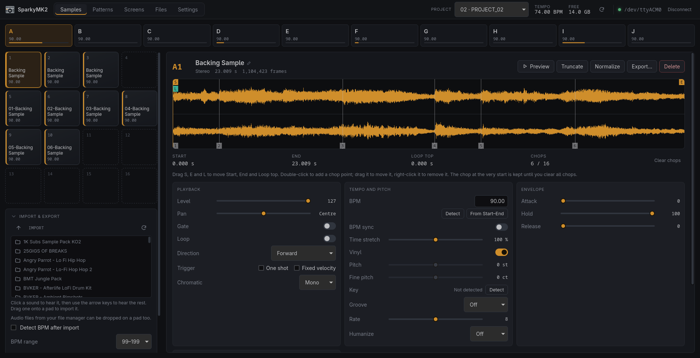
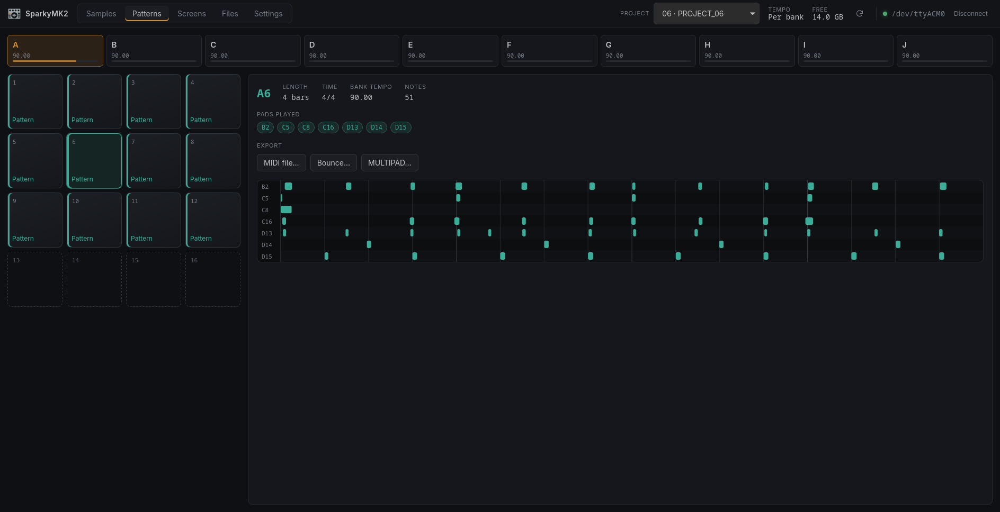
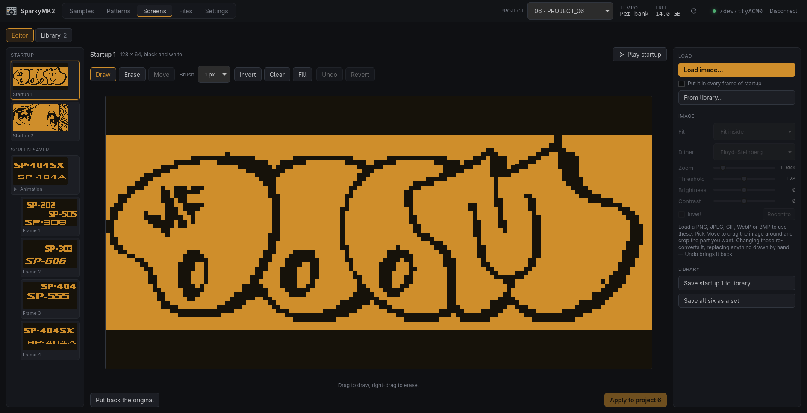
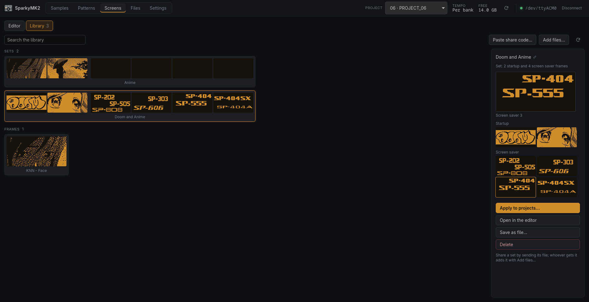
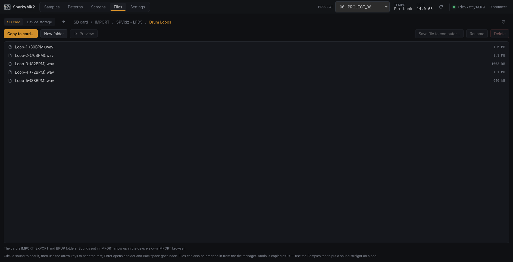
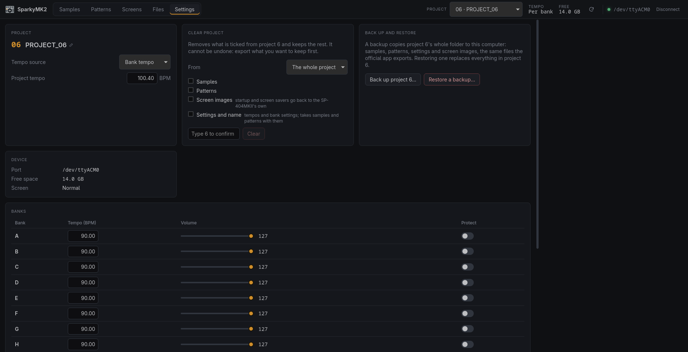

# SparkyMK2

An open-source editor and librarian for the **Roland SP-404MKII**, built for Linux.
The goal is feature parity with Roland's official SP-404MKII App (Windows/macOS): manage
samples, pads, patterns and projects on the device over USB.



> Not affiliated with or endorsed by Roland Corporation. "SP-404MKII" and "Roland" are
> trademarks of Roland Corporation.

> Vibe coded: an AI assistant wrote most of this, from the protocol notes in
> [docs/re/](docs/re/) and against real hardware. See
> [How it was made](#how-it-was-made).

## Status

**Usable day to day.** The desktop app covers most of what the official app does, and
adds a few things it doesn't: a file browser for the SD card, a screen image editor with
a library, and key detection. A command-line tool, `sp404`, does the device work too.

- Verified against an SP-404MKII on firmware **5.52**, on Linux, and the protocol on
  Windows. A user has run the app on an Apple Silicon Mac.
- Still missing from the app: waveform zoom, the chop helpers (Auto Assign, Create Chop
  Points, Snap to Grid), Emphasis, pattern import, and the official app's own settings
  (language, colours, backgrounds). A plugin version comes later.

Feature-by-feature progress against the official app is tracked in
[docs/parity.md](docs/parity.md).

## What it can do

### Samples

- Import WAV, AIFF, FLAC or MP3 at any sample rate: drop files from the computer onto a
  pad, or drag a sound off the SD card. Audio is converted to the device's 48 kHz 16-bit
  format; mono stays mono.
- Edit every pad parameter: start, end and loop top on the waveform, chop points, level,
  pan, gate, loop, direction, trigger, chromatic mode, BPM and sync, time stretch, vinyl,
  pitch, groove, rate, humanize, the envelope and routing.
- Truncate, normalize, delete, rename; move, overwrite or exchange samples between pads by
  dragging.
- Preview pads on the unit, with a playhead. Pads hit on the unit are selected in the app.
- Analyze BPM, Set BPM by Start/End, and automatic BPM detection on import, following the
  official app's rules.
- Detect a pad's key. The official app has no detector; the result is shown in the app,
  as the SP-404MKII has nowhere to keep it.
- Export a pad, a bank or a whole project as WAV files, to the SD card or the computer, and
  restore them onto the same pads later with all their settings, gaps included.

### Patterns



- See every pattern slot, and each pattern's length, tempo and notes, pad by pad.
- Export a pattern as a MIDI file (byte-identical to the official app's), a Bounce (one
  WAV) or MULTIPAD (a WAV per pad). The unit renders the WAVs itself.

### Screens



- Edit a project's startup animation and screen saver: convert any image to the device's
  128 × 64 black and white screen, panning and zooming to crop the part you want, or draw
  it pixel by pixel. Preview the animations before writing them.
- Keep frames and whole sets of six in a library: a folder of PNGs on your computer.



- Apply a frame or a set to many projects at once, without switching the unit's project.
- Share a frame as a line of text to paste in a chat, or a set as its PNG file.

### Files



- Browse both of the device's filesystems over USB and move files either way: its own
  storage (projects, samples, the factory library) and the SD card (`IMPORT`, `EXPORT`,
  `BKUP`). Copy folders on or off, rename, delete, make folders, at about 2 MB/s.
- Drop sounds straight into the card's `IMPORT` folder, where the SP-404MKII's own IMPORT
  browser finds them, without taking the card out.
- Audition anything on the device from the computer, stepping through a folder with the
  arrow keys.

### Projects and settings



- Select and rename projects; set the project and bank tempos, bank volumes and
  protection.
- Back up a whole project to the computer, the same files the official app exports, and
  restore a backup into the current project.
- Clear a project, or one bank of it: samples, patterns, screen images, settings.

### Command line and offline tools

- `sp404` does the device work from a terminal: status, pads and parameters, import and
  export, patterns, screens of the current project, backups, Init, and the file browser.
  The screen library and share codes are in the app only.
- Read project backups (`PADCONF.BIN`, pattern files, SMP samples) without the device.
- Convert audio to the SMP format, and analyse audio files for tempo and key.

## Install

Download the latest release from the
[Releases page](https://github.com/TuscanPL/SparkyMK2/releases). The packages pull in
what they need:

| System | Download | Install |
|---|---|---|
| Debian, Ubuntu, Mint | `sparkymk2_X.Y.Z_amd64.deb` | `sudo apt install ./sparkymk2_*_amd64.deb` |
| Fedora | `sparkymk2-X.Y.Z-1.x86_64.rpm` | `sudo dnf install ./sparkymk2-*.x86_64.rpm` |
| Arch, CachyOS, Manjaro | from the AUR | `yay -S sparkymk2` or `paru -S sparkymk2` |
| Other distributions | `sparkymk2_X.Y.Z_amd64.AppImage` | `chmod +x sparkymk2_*.AppImage`, then run it |
| Windows 10 or 11 | `sparkymk2_X.Y.Z_x64-setup.exe` | run it; Windows warns first, because the installer is not signed |
| macOS, Apple Silicon | `sparkymk2_X.Y.Z_aarch64.dmg` | open it, drag the app to Applications, then see [macOS setup](#macos-setup) |

The .deb, .rpm and AUR packages let the logged-in user open the SP-404MKII straight away.
With the AppImage, set up serial port access once (see [Linux setup](#linux-setup)).

The Windows build is new. The protocol work and the command-line tool both come from
Windows, but the app itself has not been tried there yet; reports are welcome. Windows
needs no driver or extra setup: the sampler appears as a COM port, and the app finds it.

The macOS build has been tried on an Apple Silicon Mac by a user (see
[#5](https://github.com/TuscanPL/SparkyMK2/issues/5)). It is Apple Silicon only; on
Intel, build from source. No driver or group membership is needed there: the
sampler appears as `/dev/cu.usbmodem…` and the app finds it.

### macOS setup

The app is not signed — there is no Apple Developer account behind this project — so
macOS quarantines it and says it "is damaged and can't be opened". It is not damaged;
that is what Gatekeeper says about anything unsigned from the internet. Open it once with
**right-click → Open → Open**, or clear the quarantine flag:

```bash
xattr -dr com.apple.quarantine /Applications/sparkymk2.app
```

## Building

You need Rust 1.85 or newer (install via [rustup](https://rustup.rs)).

```bash
git clone https://github.com/TuscanPL/SparkyMK2.git
cd SparkyMK2
cargo build --release
```

The binary is `target/release/sp404`.

### Desktop app

The app in `app/` uses [Tauri](https://tauri.app) with a Vue frontend. Besides Rust it
needs Node.js 20.19 or newer and WebKitGTK 4.1:

```bash
# Arch / CachyOS / Manjaro
sudo pacman -S --needed webkit2gtk-4.1

# Debian / Ubuntu
sudo apt install libwebkit2gtk-4.1-dev

# Fedora
sudo dnf install webkit2gtk4.1-devel
```

If a build step still reports a missing library, see Tauri's
[Linux prerequisites](https://tauri.app/start/prerequisites/#linux).

```bash
cd app
npm install
npm run tauri dev      # run with live reload
npm run tauri build    # build a release binary and packages
```

`cargo build` in the repository root builds only the command-line tool.

On Arch-based distributions you can install the app as a package, with a launcher entry
and icon. The same command updates it after you change or pull the code:

```bash
packaging/arch/update.sh
```

It builds the package from your checkout and installs it with pacman, which asks for your
password. The version includes the commit, so each new commit installs as an upgrade.

### Linux setup

USB port discovery needs libudev and pkg-config:

```bash
# Arch / CachyOS / Manjaro
sudo pacman -S --needed systemd-libs pkgconf

# Debian / Ubuntu
sudo apt install libudev-dev pkg-config

# Fedora
sudo dnf install systemd-devel pkgconf-pkg-config
```

The SP-404MKII shows up as a USB serial device (`/dev/ttyACM*`, kernel driver
`cdc_acm`). The packages give the logged-in user access to it. With the AppImage or a
source build, either install the same udev rule and replug the sampler:

```bash
sudo install -Dm644 packaging/linux/70-sp404mkii.rules /etc/udev/rules.d/70-sp404mkii.rules
```

or join the serial port group, then log out and back in:

```bash
# Arch-based distributions
sudo usermod -aG uucp "$USER"

# Debian, Ubuntu, Fedora
sudo usermod -aG dialout "$USER"
```

## Usage

Connect the SP-404MKII by USB. Only one program can use the device at a time, so quit
or disconnect the official app first.

```bash
sp404 status                          # current project, tempo, free space
sp404 pads                            # pads that hold samples
sp404 pad B1                          # all parameters of pad B1
sp404 set B1 level 100                # change a parameter (`sp404 params` lists them)

sp404 import J16 loop.flac --detect-bpm   # import audio onto a pad, detect its tempo
sp404 sample-to-wav B1 bass.wav           # export a pad's sample
sp404 analyze-pad B1 --set-bpm            # detect tempo and key, store the BPM

sp404 export-project 6 ./backup       # back up project 6
sp404 export-pattern A1 beat.mid      # pattern → MIDI file
sp404 bounce-pattern A1 beat.wav      # pattern → WAV rendered by the device
```

Run `sp404 --help` for all commands, and `sp404 <command> --help` for details. Add `-v`
or `-vv` to log protocol traffic.

### Commands that erase data

- `init-project` and `restore-project` overwrite a project on the SD card. Both refuse to
  run without `--yes`.
- Both select the target project on the device first: the device always applies Init to
  the project that is currently selected.
- Back up with `export-project` before using them.

## Project layout

```
crates/sp404-proto     protocol without I/O: framing, file API, parameters, pads, patterns
crates/sp404-formats   SMP samples, PADCONF.BIN, patterns, MIDI export, audio import
crates/sp404-device    USB serial connection (0582:02E7, 921600 baud)
crates/sp404-dsp       tempo and key detection
crates/sp404-cli       the `sp404` command-line tool
app/                   desktop app: Vue frontend, Tauri backend in app/src-tauri
packaging/             Arch and AUR packages, launcher entry, udev rule
scripts/release.sh     prepares a release (see docs/releasing.md)
docs/re/               protocol and file-format specification
docs/parity.md         feature checklist against the official app
tools/                 Windows capture and analysis scripts used for reverse engineering
```

## How it was made

The protocol was reverse-engineered by recording the USB traffic between the official app
and the device, and by studying the app's behaviour. Everything learned is written up as
a specification in [docs/re/](docs/re/). The Rust code is written from that specification.

The project follows a clean-room process: no Roland code, firmware or assets are included.
Please read [docs/clean-room.md](docs/clean-room.md) before contributing.

**It is a vibe coded project.** An AI assistant wrote most of the code, working from those
specifications, and the results were tried on a real SP-404MKII: the command-line tool and
the app have both driven the device, and `docs/re/` records what the hardware actually
answered.

The specifications are the part worth keeping. If you would rather not run code written
that way, [docs/re/](docs/re/) describes the transport, the commands, the parameters and
the file formats in enough detail to write your own client by hand. Reading what is here
and reimplementing it yourself is a perfectly good use of this repository, and you are
welcome to it.

## Roadmap

- **Closing the gaps with the official app:** waveform zoom, the chop helpers (Auto
  Assign, Create Chop Points, Snap to Grid), Emphasis, the Info Mode views, pattern import,
  and dragging pads out to the file manager.
- **Remaining protocol gaps:**
  - Partial project imports (a single bank of samples or patterns)
  - The device message carrying the BPM detect range
  - The firmware check and the names of the working modes
- **Windows testing** of the app itself.
- **Plugin build** (VST3/CLAP/LV2), later.

## Credits

The Faceplate app icon is original SP-404-inspired artwork contributed by
[diamond-one](https://github.com/diamond-one), under the project's GPL-3.0-or-later
license. Editable SVG sources and export details are in
[app/src-tauri/icons/](app/src-tauri/icons/README.md).

## License

GPL-3.0-or-later. See [LICENSE](LICENSE).
